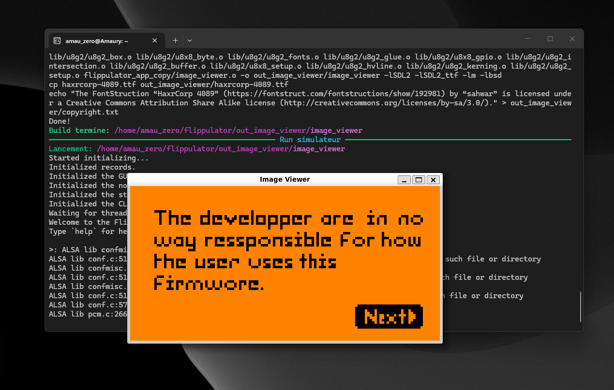

# Zero_SIM Toolkit by Amau_Zero

Website: [amauzero.info](https://amauzero.info)

Clean workflow for Zero_SIM with:
- dependency bootstrap
- quiet app build (logs shown only on error)
- one-command simulator launch
- interactive menu with a Settings mode

## Requirements

- Windows + WSL (recommended for Linux dependencies)
- Python 3 (`python` or `py -3` on Windows)
- Git
- Node.js + npm (optional if you use fallback example mode)

## Screenshot



## Clone

```bash
git clone https://github.com/Vaidx0/Zero_SIM.git
cd Zero_SIM
```

## Important First Step

Create or use an app folder before building.

An example app is already included:
- `example_hello_world`

You can also create your own app folder in the repository root and include an `application.fam`.

## First Run Behavior

On first launch, `simulator.py` performs an initial cleanup in the cloned folder:
- removes `assets/`
- removes `LICENSE`
- removes `.gitignore`

This is done once and tracked by `.zero_sim_cleaned`.

## Dependency Setup

Run from the repository folder (where `simulator.py` is located):

```bash
python simulator.py deps
```

If `python` is not available:

```bash
py -3 simulator.py deps
```

Do not use `python3` on standard Windows PowerShell unless you explicitly installed that alias.

## Build an App

```bash
python simulator.py build example_hello_world
```

## Run the Simulator

```bash
python simulator.py run example_hello_world
```

## Interactive Mode

```bash
python simulator.py
```

Menu options:
- install dependencies
- build app
- run simulator
- settings (switch theme: dark/light)

## Notes

- If `package.json` is missing, the script switches to fallback mode and can still build/run `example_hello_world`.
- Linux dependency tools (`dpkg`, `apt-get`, `sudo`) must run in WSL/Linux shell.
- Build logs stay hidden unless a step fails.

## Author

<table>
  <tr>
    <td width="220" align="center">
      
    </td>
    <td align="left" valign="middle">
      <strong>Amau_Zero</strong><br />
      <a href="https://amauzero.info">https://amauzero.info</a>
    </td>
  </tr>
</table>

