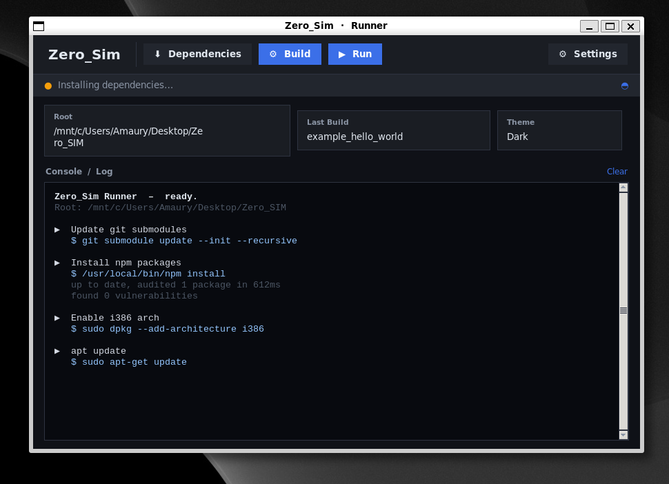

# Zero_SIM by Amau_Zero

Full Flipper simulator workflow wrapped by `simulator.py`.

## Screenshot




## Setup (WSL first)

```bash
# 1) Open WSL terminal first
# 2) Create a folder where Zero_SIM will be installed
mkdir -p ~/zero_workspace
cd ~/zero_workspace

# 3) Clone and enter repository
git clone https://github.com/Vaidx0/Zero_SIM.git
cd Zero_SIM
```

## Use only simulator.py

Run everything through the Python runner:

```bash
python simulator.py
```

Menu flow (mandatory order in GUI):
1. Click **Dependencies** first
2. Then click **Build**
3. Then click **Run**
4. Settings (dark/light)

## Direct commands (optional)

```bash
python simulator.py deps
python simulator.py build example_hello_world
python simulator.py run example_hello_world
```

## Notes

- **Sudo is required** for dependency installation/build steps in WSL/Linux (`sudo` must be available).
- In GUI, follow this order only: **Dependencies -> Build -> Run**.

- The script now prints build output when binary generation fails.
- If build fails, it automatically retries once in verbose mode to show compiler errors.
- Do not run `npm start` directly; use `simulator.py` only.

## Author

<table>
  <tr>
    <td width="220" align="center">
      
    </td>
    <td align="left" valign="middle">
      <strong>Amau_Zero</strong><br />
      <a href="https://amauzero.info">https://amauzero.info</a>
    </td>
  </tr>
</table>
